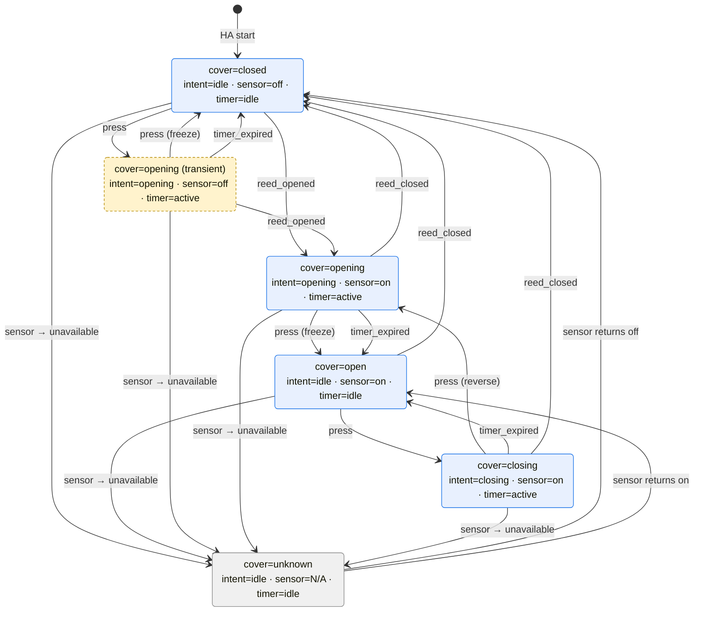

# Home Assistant integration

This folder collects the Home Assistant artifacts that surface the Pico garage opener as a `cover` entity with state-machine semantics. The cover entity lives in `cover/`; the Lovelace card that renders it lives in `card/`; the shared state-machine diagram lives at the top level because both subsystems describe the same FSM (the cover implements it, the card renders it).

## Layout

```
home-assistant/
├── README.md
├── cover-state-machine.mmd     # FSM source, embedded below
├── cover/
│   ├── garage_cover.yaml       # HA package: cover entity + helpers + automation
│   └── deploy.sh               # Push to HA host, validate, reload components
└── card/
    ├── cover-card.js           # Helper functions (source of truth)
    ├── cover-card.test.js      # Unit tests against the helpers
    ├── cover-card.template.yaml  # button-card skeleton with /* @inline-helpers */
    ├── build-card.mjs          # Inlines helpers into the template
    ├── cover-card.generated.yaml # Build artifact (gitignored)
    ├── deploy.sh               # Build, test, push to dashboard
    ├── deploy_card.py          # Runs inside hassio_supervisor to do the lovelace WS dance
    └── .gitignore
```

The package YAML in `cover/` is the source of truth for `cover.garage_door`; the deployed file on the HA host at `/mnt/data/supervisor/homeassistant/packages/garage_cover.yaml` is written from it by `cover/deploy.sh`.

## Deploy

Both deploy scripts authenticate against HA by piggy-backing on an addon the supervisor already runs: `SUPERVISOR_TOKEN` is extracted from `addon_core_configurator` (the File Editor addon) via `docker exec`, then used to reach HA through the supervisor proxy. The File Editor addon's token has the `homeassistant_api` permission we need; the lighter-weight `hassio_cli` container's token does not. No long-lived access token to create or store on your machine — `ssh ha` is the only credential needed.

Prerequisite: the File Editor addon (`core_configurator`) must be installed on the HA host. *Settings → Add-ons → Add-on Store → File editor → Install*.

### Cover package

From `cover/`:

```sh
./deploy.sh
```

The script writes a recovery backup to `/tmp/garage_cover.yaml.previous` on the host, pushes the YAML over `ssh ha`, runs `ha core check`, and reloads the `input_select`, `timer`, `template`, and `automation` components by curl'ing `http://supervisor/core/api/services/<domain>/reload` from inside the `addon_core_configurator` container (whose `SUPERVISOR_TOKEN` carries the needed permissions). No HA restart needed.

Manual recovery: `ssh ha "cp /tmp/garage_cover.yaml.previous /mnt/data/supervisor/homeassistant/packages/garage_cover.yaml"` and re-run the script.

Requires: `ssh ha` working.

### Card

From `card/`:

```sh
node --test cover-card.test.js   # exercises the helpers in isolation
node build-card.mjs              # regenerates cover-card.generated.yaml
./deploy.sh                      # runs tests, builds, and pushes via the supervisor's WebSocket proxy
```

`deploy.sh` runs `deploy_card.py` inside `hassio_supervisor` (which has Python + aiohttp); the script talks to `ws://supervisor/core/websocket` using the token shipped in via `docker exec -e`, reads the current dashboard config, patches the `cover.garage_door` button-card in place, and saves. It refuses to run if it can't find exactly one matching card. No `/config/www/` copy, no Lovelace resource registration — the card is fully self-contained.

Requires: `ssh ha` working, local `python3` with `PyYAML` (for the YAML → JSON conversion before piping over SSH).

## State machine



The cover has one true state variable, `intent` (`idle` / `opening` / `closing`), stored in `input_select.garage_door_intent`. The reed switch (`binary_sensor.garage_door`) and travel timer (`timer.garage_door_travel`) are an input and a mechanism, not independent state — the timer is active iff `intent ∈ {opening, closing}` by construction.

The displayed cover state derives from `(intent, sensor)`:

| intent | sensor | cover state |
|---|---|---|
| `idle` | `off` | `closed` |
| `idle` | `on` | `open` |
| `idle` | unavailable | `unknown` |
| `opening` | any | `opening` |
| `closing` | any | `closing` |

When the sensor goes unavailable, we reset `intent` to `idle` and cancel the timer rather than keep showing a guessed state, because out-of-band events (manual lift, remote-button intervention, obstruction reverse) can desync our model from reality and a stale "opening" is worse than an honest "unknown."

## Events

- `press` — `button.garage_door` state advances to a new timestamp (filtered to exclude `unknown`/`unavailable` → timestamp transitions on Pico reconnect).
- `reed_opened` — `binary_sensor.garage_door` transitions `off → on` (door physically leaves the fully-closed position).
- `reed_closed` — `binary_sensor.garage_door` transitions to `off` (door reaches fully-closed; covers obstruction reverses, out-of-band closes, normal closes).
- `timer_expired` — travel timer's window elapses (15 s by default; tune in `cover/garage_cover.yaml` if your door takes longer).
- `sensor → unavailable` — `binary_sensor.garage_door` becomes unavailable or unknown.
- `sensor returns off/on` — sensor recovers from unavailable.

## Why no `cover.stop_cover`

Consumer US garage openers (UL325-compliant) reverse on press-during-close rather than halt-at-position, so exposing `stop_cover` and silently reverse-opening would violate the contract Home Assistant users expect from the service. Press-during-opening does freeze the door, but advertising STOP for only one direction is worse UX than omitting it; the MyQ, Aladdin Connect, and Chamberlain integrations all omit STOP for the same reason.

`cover.open_cover` already covers both behaviors: from `opening` it presses the relay and freezes, from `closing` it presses the relay and reverses. The underlying `button.garage_door` entity is also directly callable when something needs to fire the relay without going through cover semantics — e.g., an automation that just wants to pulse the opener without HA reasoning about state.
